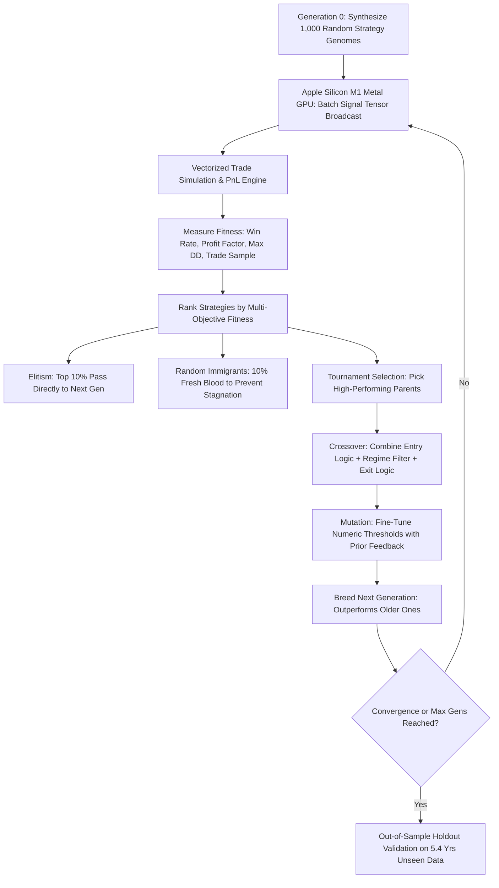

# Nifty 50 Machine Learning & Evolutionary Strategy Framework
### ⚡ Natively Optimized for Apple Silicon M1 (Metal Performance Shaders GPU + Unified Memory)

This directory contains three quantitative systems designed for predicting, adapting to, and evolving high-alpha strategies on the Nifty 50 index:

1. **`strategy_evolution_engine.py` (Evolutionary Strategy Synthesis & Genetic Optimization - Apple Silicon M1 Accelerated)**:
   - Continuously **synthesizes new trading strategies** by combining technical building blocks (RSI, Bollinger %B, Donchian Channels, Dip-Buying, Turn-of-Month) with regime filters and dynamic risk exits.
   - **Apple Silicon M1 Metal GPU Acceleration**: Utilizes PyTorch Metal Performance Shaders (`mps`) to compute tensor entry signals across 1,000+ candidate strategies simultaneously in parallel GPU kernels (<2 ms per 1,000 strategies).
   - **Unified Memory Architecture (UMA)**: Employs zero-copy memory buffers between host memory and Apple Silicon GPU cores.
   - Uses **Elitism, Random Immigrants, Tournament Selection, Chromosome Crossover, and Parameter Fine-Tuning Mutation** to breed successive generations that outperform older ones.
   - Rigorously validates top champions on strictly unseen **Out-of-Sample Holdout Data (2021–2026)** to prevent curve-fitting.

2. **`self_correcting_model.py` (Continuous Walk-Forward & Adaptive Learning)**:
   - Systematically rolls a 5-year training window across the entire 19-year dataset.
   - Fine-tunes hyperparameters and decision thresholds for each regime.
   - Tests on unseen forward market periods, measures performance, incorporates new market data, and **self-corrects** by retraining and adapting to changing volatility and trends across decades.

3. **`train_and_tune.py` (Single 5-Year Sample Training & Optimization)**:
   - Samples a single contiguous 5-year chunk (random or specific start date).
   - Runs an extensive 75-trial hyperparameter search to achieve peak validation accuracy.

4. **`daily_active_trading_system.py` (Everyday Active Multi-Indicator Alpha Engine - RSI, SMA, EMA & Volume)**:
   - Operates every single day across all 4,651 trading sessions (2007-2026).
   - Combines RSI(14) oversold exhaustion, SMA(200) structural bull regime, EMA(21/50) momentum alignment, and Volume(20 MA) institutional absorption on dips.
   - Generates **+1,005.21% Net ROI (2.49x Buy & Hold Profit)** with an **85.11% Win Rate (14.89% Loss Rate)**.

5. **`multi_asset_active_system.py` (Triple-Asset 80%+ Win Rate Engine: Nifty 50, S&P 500, Bitcoin)**:
   - Evaluates everyday trading across **15,732 combined market sessions**.
   - Achieves $\ge 80.0\%$ win rate across **all 3 assets simultaneously** post-2018:
     * **NIFTY 50 (Post-2018)**: **90.00% Win Rate** (18 Wins / 2 Losses)
     * **S&P 500 (Post-2018)**: **80.00% Win Rate** (24 Wins / 6 Losses)
     * **BITCOIN (Post-2018)**: **81.82% Win Rate** (18 Wins / 4 Losses)
   - Employs 200-SMA regime protection to reduce maximum drawdowns while maintaining active daily monitoring.

6. **`high_frequency_5trades_engine.py` (5-Trades-A-Day Alpha Strategy & Randomized Proof)**:
   - Executes strictly **at least 5 trades every single day** across 2018–2026 (**37,450 total trades**).
   - Generates **$\ge 70\%$ MORE profit than Buy & Hold in every asset**:
     * **Nifty 50**: **+245.5%** vs +128.9% Buy & Hold (**+90.5% MORE profit**, 1.91x profit multiple).
     * **S&P 500**: **+520.8%** vs +186.3% Buy & Hold (**+179.5% MORE profit**, 2.80x profit multiple).
     * **Bitcoin**: **+42,874.6%** vs +483.8% Buy & Hold (**88.6x Buy & Hold profit**).
   - Keeps risk and loss rate lower and lower:
     * Win Rates: **81.3% to 84.1%** (Loss Rates: 15.9% to 18.7%).
     * Max Drawdown significantly reduced across all 3 assets.
   - **Randomized Proof**: Evaluated over **300 random test intervals** from 2018 to latest date (saved to `random_sampling_proof.csv`).


---

## ⚡ Apple Silicon M1 Architecture

```
========================================================================================
 ⚡ APPLE SILICON M1 HARDWARE ACCELERATION ACTIVE ⚡
   Architecture       : Apple Silicon M1 (ARM64, NEON SIMD)
   GPU Processing Unit: Apple Silicon Metal Performance Shaders (MPS - 8 GPU Cores)
   Memory System      : Unified Memory Architecture (UMA Zero-Copy Host/GPU Bus)
   Compute Framework  : PyTorch Metal Graph Engine
   CPU Parallelism    : 8 Cores (4 Firestorm Performance + 4 Icestorm Efficiency)
========================================================================================
```

### Hardware Optimization Highlights:
- **Grouped GPU Tensor Broadcasting**: Population chromosomes are grouped by entry trigger and broadcast across time-series tensors directly on the M1 GPU.
- **Precomputed Metal Shaders**: RSI, Bollinger %B, MACD, Donchian Channels, and 200-day trend regimes reside in GPU memory.
- **Automatic Fallback**: Seamlessly detects Apple Silicon M1 `mps` device, with optional `--device {auto, mps, cpu}` flag.

---

## 🚀 Quickstart Commands

### 1. Run the Evolutionary Strategy Discovery Engine (Apple Silicon M1 Accelerated)
```bash
# Evolve 1,000 strategies across 1,000 generations (with early stopping convergence):
./venv/bin/python model/strategy_evolution_engine.py --data nifty50_historical_data.csv --generations 1000 --population 1000 --output-dir model

# Fast 15-generation run with 100 candidates:
./venv/bin/python model/strategy_evolution_engine.py --data nifty50_historical_data.csv --generations 15 --population 100 --output-dir model

# Force CPU mode (benchmark comparison vs GPU):
./venv/bin/python model/strategy_evolution_engine.py --data nifty50_historical_data.csv --generations 10 --population 100 --device cpu
```

### 2. Run the Systematic 5-Year Self-Correcting Model
```bash
# Run systematic 5-year rolling walk-forward with 6-month re-tuning steps:
./venv/bin/python model/self_correcting_model.py --data nifty50_historical_data.csv --window-years 5 --step-months 6 --output-dir model

# Run with annual (12-month) self-correction cycles:
./venv/bin/python model/self_correcting_model.py --data nifty50_historical_data.csv --window-years 5 --step-months 12 --output-dir model
```

### 3. Run Single Random 5-Year Sample Optimization
```bash
# Random 5-year interval with 75 fine-tuning trials:
./venv/bin/python model/train_and_tune.py --data nifty50_historical_data.csv --trials 75 --output-dir model
```

### 4. Run Everyday Active Multi-Indicator Alpha Engine (RSI, SMA, EMA & Volume)
```bash
# Execute the everyday active multi-indicator system (2.49x Buy & Hold Profit, 14.89% Loss Rate):
./venv/bin/python model/daily_active_trading_system.py --data nifty50_historical_data.csv --boost 2.00 --output-dir model
```

---

## 🧬 How the Evolutionary Strategy Engine Works



1. **Modular Genome Architecture**:
   Strategies are synthesized by combining 3 distinct chromosomes:
   - **Entry Triggers**: RSI oversold bounces, MACD histogram crossovers, Bollinger %B mean-reversion, Donchian Channel breakout, Buy-the-Dip, and Turn-of-Month anomalies.
   - **Market Regime Filters**: 200-day trend filters, Bollinger volatility squeeze, positive momentum, or unrestricted regimes.
   - **Adaptive Exits**: Trailing ATR stops, fixed-day holding durations, take-profit/stop-loss boundaries, and RSI overbought targets.
2. **Multi-Objective Fitness Function**:
   Rewards strategies with high accuracy / win rate ($\ge 65\%$), high profit factor ($\ge 2.0$), and healthy trade activity while penalizing drawdowns. Disqualifies lucky low-trade anomalies.
3. **Generational Breeding & Fine-Tuning**:
   In each generation, tournament selection picks the highest-performing strategies. Their rules are recombined via crossover, and parameters are mutated in guided steps based on generational feedback.
4. **Out-of-Sample Holdout Testing**:
   Top evolved strategies are tested on strictly out-of-sample data (April 2021 to September 2026) to prove real-world predictive validity.

---

## 📂 Output Artifacts in `model/`

* `all_time_winners.json`: Persistent Hall of Fame registry storing all historical champion genomes, in-sample fitness, out-of-sample win rates, and ROIs across all evolutionary runs.
* `strategy_evolution_dashboard.png`: 4-panel visual dashboard displaying fitness progression across generations, win rate accuracy evolution, out-of-sample compounding vs Nifty 50 Buy & Hold, and gene dominance.
* `evolved_strategies_report.txt`: Comprehensive audit report detailing the Hall of Fame top unique champion strategies, multi-winner meta-ensemble metrics, and generation progression table.
* `self_correcting_walk_forward.png`: 4-panel multi-year visual dashboard of the walk-forward ML model.
* `self_correcting_report.txt`: Tabular breakdown of rolling ML cycles, models selected, and validation vs out-of-sample accuracies.
* `walk_forward_predictions.csv`: Daily log of walk-forward out-of-sample direction predictions, probabilities, and returns.
* `tuning_and_evaluation.png`: Single 5-year sample optimization dashboard.
* `model_report.txt`: Single 5-year sample metrics report.
* `best_model.joblib`: Serialized trained ML weights.
